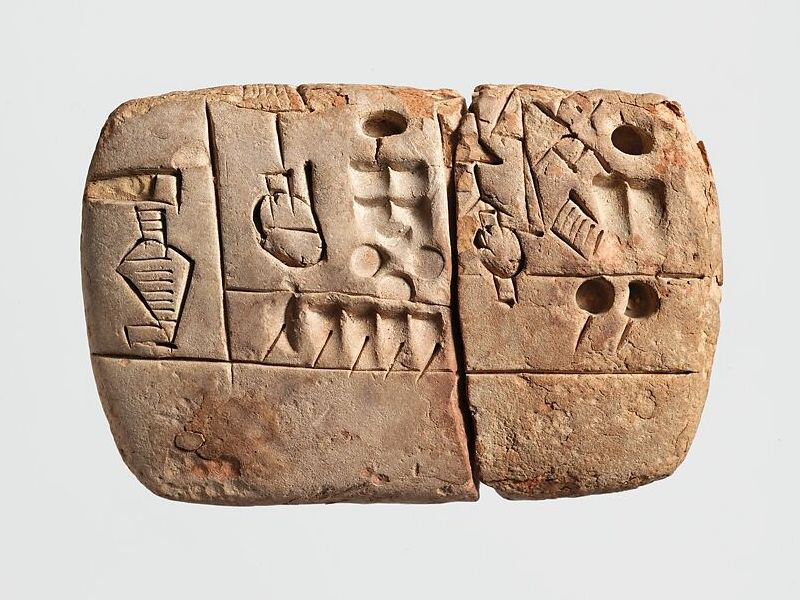
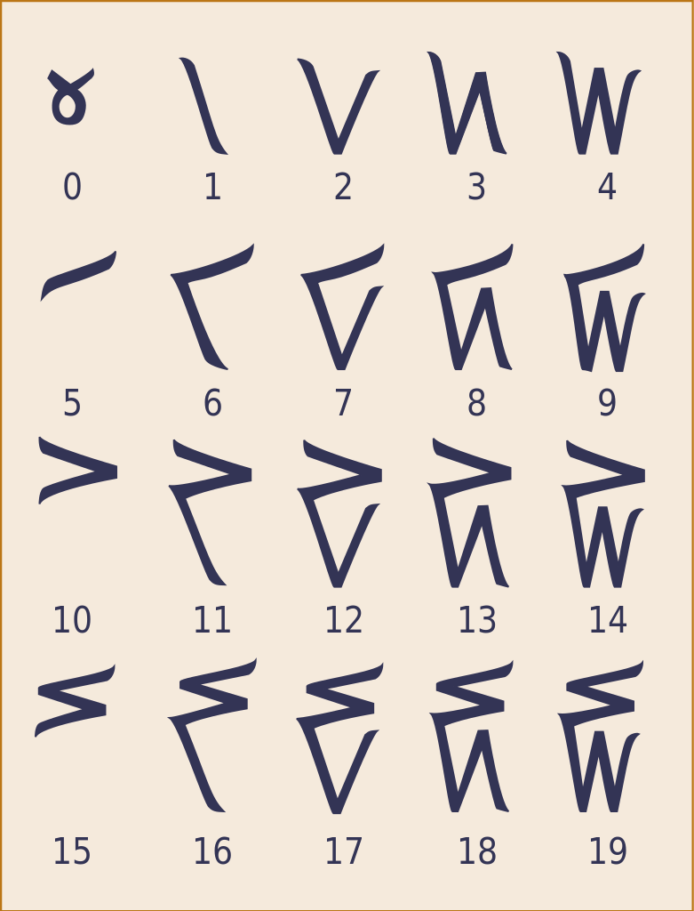
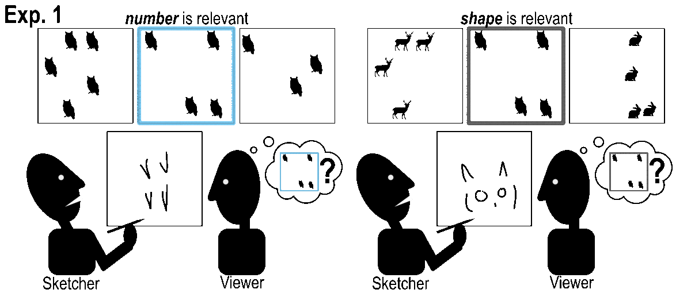

# Ad Hoc Numerals

Graphical representations of number (i.e. numerals) come in many diverse forms, historically predate written language, and are a powerful cognitive tool for transmitting abstract concepts about number. How did they emerge? This repo contains 3 experiments investigating how people create graphical representations of number within communicative contexts.

<table>
  <tr> 
 Some examples of different numerals: 
 </tr>
  <tr>
    <td valign="top" width="395px">
         
 WWII airforce pilot, representing a 1-to-1 tally using marks that correspond to each type of event. (<a href="https://www.aircorpsart.com/blog/aircraft-victory-mission-markings-of-wwii/">source</a>)
</td>
    <td valign="top"  width="400px">
         
 Mesopotamian administrative tablet representing object-types (barley) and quantities in separate graphical forms, ca. 5,000 yBP. (<a href="https://www.metmuseum.org/art/collection/search/327385">source</a>) 
</td>
    <td valign="top" width="240px">
         
 Numerals invented by Iñupiaq students in the 1990s to represent a base-20 system. (<a href="https://en.wikipedia.org/wiki/Kaktovik_numerals">source</a>) 
 </td>
  </tr>
</table>

## Experiments
Partners played a reference game in which one person used graphical tools to communicate numerical information to their partner, using graphical tools.
- In **Experiment 1**, we asked whether and how people would distill numerical information from arrays of objects to create a specifically numerical representation.
- In **Experiment 2**, we asked whether objects arranged in predictable, regular arrays made it easier to develop graphical conventions about number that transcended the use of 1-to-1 correspondence.
- In **Experiment 3**, we asked how the presence of existing symbols might be used to create representations of number in a left-to-right communicative medium.

  </img>
  Cartoon of the methods used in each experiment.

## This Repo

### Anonymized Pre-registrations
- Available as PDFs under `/osf/`.

### Source Code for Experiments
- Source code for communication tasks is in `/experiments/`, in directories that contain "draw_number".
- Source code for recognition tasks is in `/experiments/`, in directories that contain "classify_iternum".
- Source code for stimulus generation is in `/stimuli/`, in directories with names that match those in `/experiments/`.
- Some additional tools used in the above are in `/utils/`.

### Analysis
- An R script for our pre-registered statistical models can be found in `/analysis/analyses.R`.
- A python notebook for manuscript figures and some simple descriptive statistics can be found in `/analysis/main_analyses.ipynb/`.
- One additional supplementary analysis can be found in `/analysis/supplementary_analysis.ipynb/`.
- Helper functions can be found in `/analysis/utils/`.

### Data & Figures
- `/analysis/results/csv/` contains CSVs of all processed experimental data. It also contains `/extra/`, with raw data, as well as `/features/` and `/classifier/`, generated in the supplementary analysis.
- `/analysis/results/plots/` contains Jupyter notebook output that was used to create the figures in the manuscript.
- `/analysis/results/bare_sketches/` contains sketch results from each experiment, to be processed in our supplementary analysis.
- `/analysis/results/bare_targets/` contains target images for the above sketches.
- `/analysis/results/sketch/` contains sketches annotated with correct / incorrect viewer response, and the corresponding target image.
- `/analysis/results/sketch_galleries/` contains all of the above sketches, arranged into galleries that show all trials from a given game.

